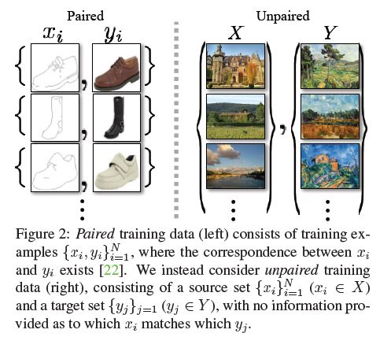
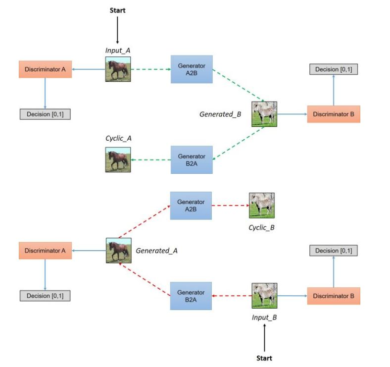

# Paper

* **Title**: Unpaired Image-to-Image Translation using Cycle-Consistent Adversarial Networks
* **Authors**: Jun-Yan Zhou*,Taesung Park*
* **Link**: https://arxiv.org/abs/1703.10593
* **Tags**: 
* **Year**: 2018

# Summary

* What
  * The goal of Image-to-image translation is to learn the mapping between an input image and an output image using a training set of aligned image pairs.
  * We present an approach for learning to translate an image from a source domain X to a target domain Y in the absence of paired examples.  
  * 在配对数据集中，源域中的每张图像imgA可以人为地映射到目标域中的某个图像imgB，以便两者共享各种特征。从imgA到imgB的特征可用于其相对应的映射当中。当一张图像从一个域到另一个域时，该映射定义了一种有意义的变换。因此，当我们配对数据集时，生成器将inputA，映射到输出图像，genB，原始图像需要与其映射对象接近。
  * 在不配对数据集中没有对象之间的对应，也没有预先定义好的用于训练的有意义转换，所以我们需要创建它。作者通过生成器将输入图像从域A映射到域B，转换成对应输出图像。为了确保图像之间存在有意义的关系，它们必须共享一些特征，这些特征可用于将此输出图像映射回输入图像，因此必须有另一个生成器能将此输出图像映射回原始域。  
  

* How
  * capture special characteristics of one image collection and figure out how these characteristics could be translated into the other image collection, all in the absence of any paired training examples.
  * We assume there is some **underlying** relationship between the domains – for example, that they are two different renderings of the same underlying scene – and seek to learn that relationship. Although we lack supervision in the form of paired examples, we can exploit supervision at the level of sets: we are given one set of images in domain X and a different set in domain Y .  
    
  * 该模型通过从域DA获取输入图像，该输入图像被传递到第一个生成器GeneratorA2B，其任务是将来自域DA的给定图像转换到目标域DB中的图像。然后这个新生成的图像被传递到另一个生成器GeneratorB2A，其任务是在原始域DA转换回图像CyclicA。CyclicA需要与inputA相似，用来定义非配对数据集中原来不存在的有意义映射。  
如上图所示，两个输入被传递到对应的鉴别器（一个是对应于该域的原始图像，另一个是通过生成器产生的图像），并且鉴别器的任务是区分它们，识别出生成器输出的生成图像，并拒绝此生成图像。生成器想要确保这些图像被鉴别器接受，所以它将尝试生成与DB类中原始图像非常接近的新图像。事实上，在生成器分布与所需分布相同时，生成器和鉴别器之间实现了纳什均衡（Nash equilibrium）。